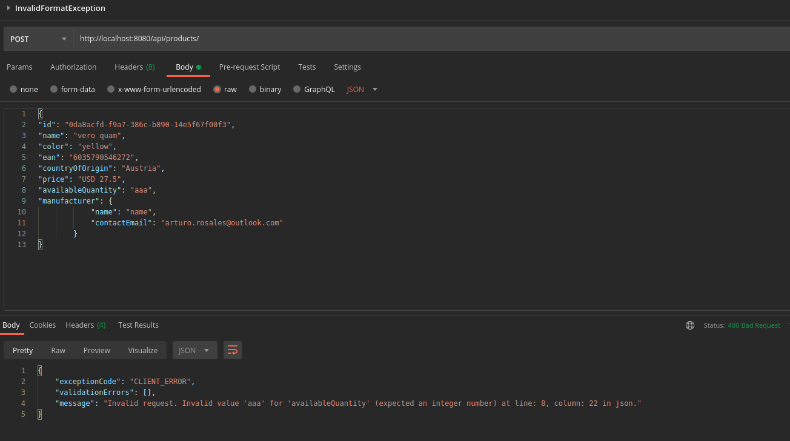
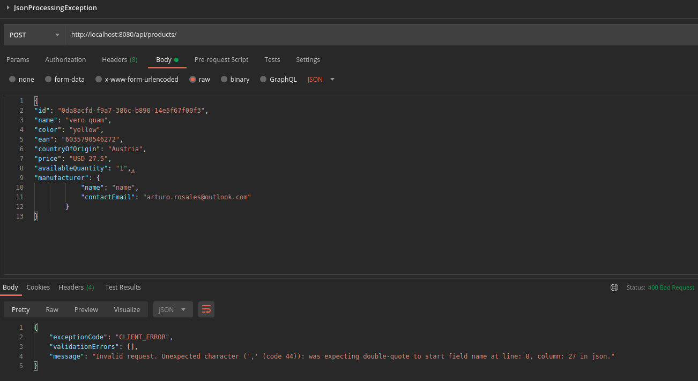
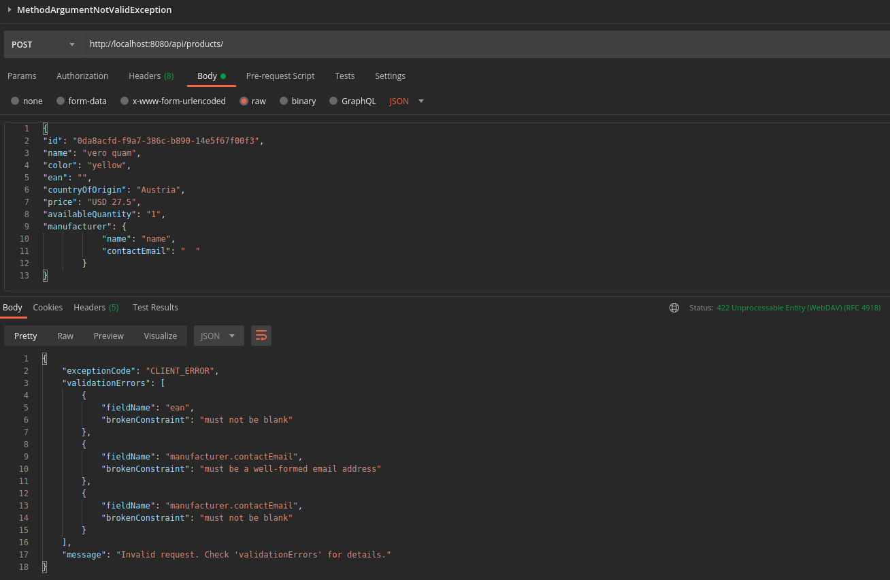
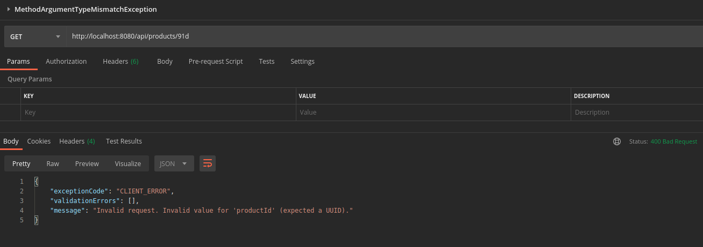

# spring-boot-controller-advice

[](https://keepgrowing.in/)

This is a demo project to test how global exception handling work in an example Spring Boot project.


## Prerequisites

* JDK 17+ ([How to install OpenJDK 17 on Ubuntu](https://keepgrowing.in/java/how-to-install-openjdk-17-on-ubuntu/))
* [Maven](https://maven.apache.org/) (or you can use `mvnw` provided in the project)

## Getting started

First, [clone](https://docs.github.com/en/github/creating-cloning-and-archiving-repositories/cloning-a-repository-from-github/cloning-a-repository)
this repository.

Then, build it locally with:

```bash
mvn clean install
```

Finally, you can run the application with:

```bash
mvn spring-boot:run
```

## Examples

You'll find the Postman collection with example requests in the [postman](https://github.com/little-pinecone/spring-boot-controller-advice/tree/master/postman) directory. 
The examples contain both correct and incorrect requests to help you work with this project.

Some examples:









## Built With

* [Spring Boot v2.6+](https://spring.io/projects/spring-boot)
* [Maven](https://maven.apache.org/)
* [Dummy4j](https://daniel-frak.github.io/dummy4j/)